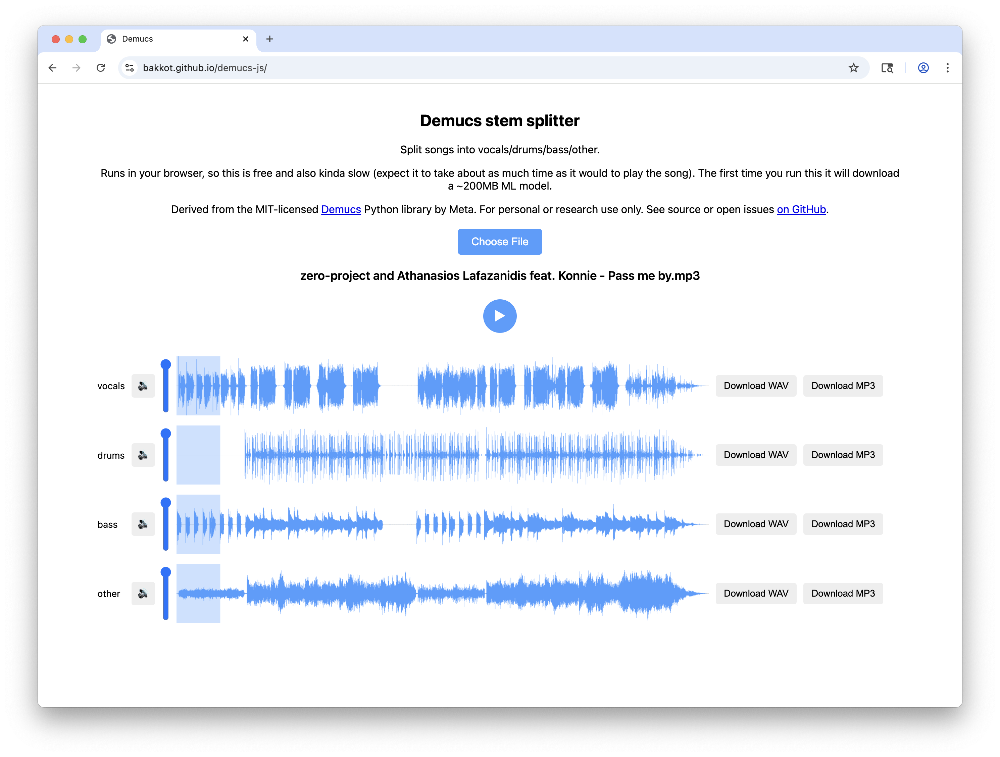

# Demucs in JavaScript

This is a port of Meta's MIT-licensed [Demucs](https://github.com/facebookresearch/demucs) Python+PyTorch library to JavaScript+[ONNX](https://onnx.ai/). This allows it to run on the web, as well as to be installed and used [via `npm`](https://www.npmjs.com/package/demucs).

Most users will want [to use the web version](https://bakkot.github.io/demucs-js). This is completely free and in fact does no not involve any server at all except the static fileserver generously provided by GitHub.

Weights are included here for convenience but see [LICENSE.md](./LICENSE.md) for license information.



## Running from the CLI

This package is also available [on `npm`](https://www.npmjs.com/package/demucs), with weights included:

```sh
npm install -g demucs
```

This will give you a `demucs` command which will split `.wav` files. To handle other types you'll need to do the conversion yourself first, probably with `ffmpeg`; this project wants 44.1 kHz files. Options:

- `--mp3` to transcode the output to 256kbps `.mp3` instead of `.wav`
- `--output <dir>` to specify the output directory. Default: `./separated`.
- `--overlap <float>` to specify how much each chunk should overlap (in the range 0-1). Smaller values will transcode faster but can lead to weird output. Default: `0.25`.

## Running the web version

If for some reason you want to have your own hosted copy, just check out this repo, `npm ci`, `npm run build-web`, and then serve the `build-web` directory, for example with `npx http-server build-web`.

## Details

Specifically, this is the 4-stem "Hybrid Transformer" version 4 from the Demucs project. The model includes some operations which cannot run in ONNX, which must be extracted; this project takes inspiration from [this other project](https://github.com/sevagh/demucs.onnx?tab=readme-ov-file#idea-and-pythonpytorch-implementation) which did the same thing but with a C++ wrapper rather than a JavaScript wrapper.

MP3 encoding is handled by the excellent [Mediabunny](https://mediabunny.dev/) project.

In the browser, transcoding from input audio types is handled by [browser APIs](https://developer.mozilla.org/en-US/docs/Web/API/BaseAudioContext/decodeAudioData).

Claude wrote much of the code, thanks Claude.

## Performance

ONNX uses WebGPU on [browsers which support it](https://developer.mozilla.org/en-US/docs/Web/API/WebGPU_API). On my machine, that allows it to run at about 3x realtime. Performance on your machine may differ. If your browser does not support WebGPU it will be much, much slower (but should still work).

The CLI version uses onnxruntime-node which also usually uses the GPU.
